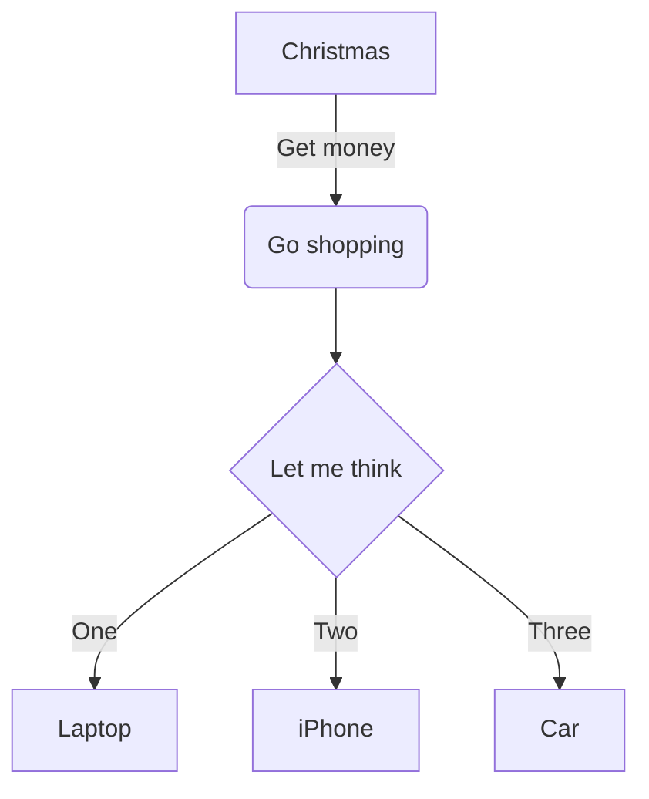
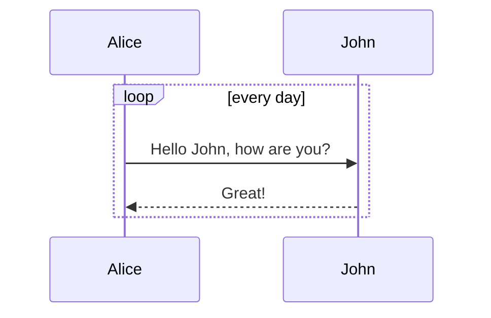
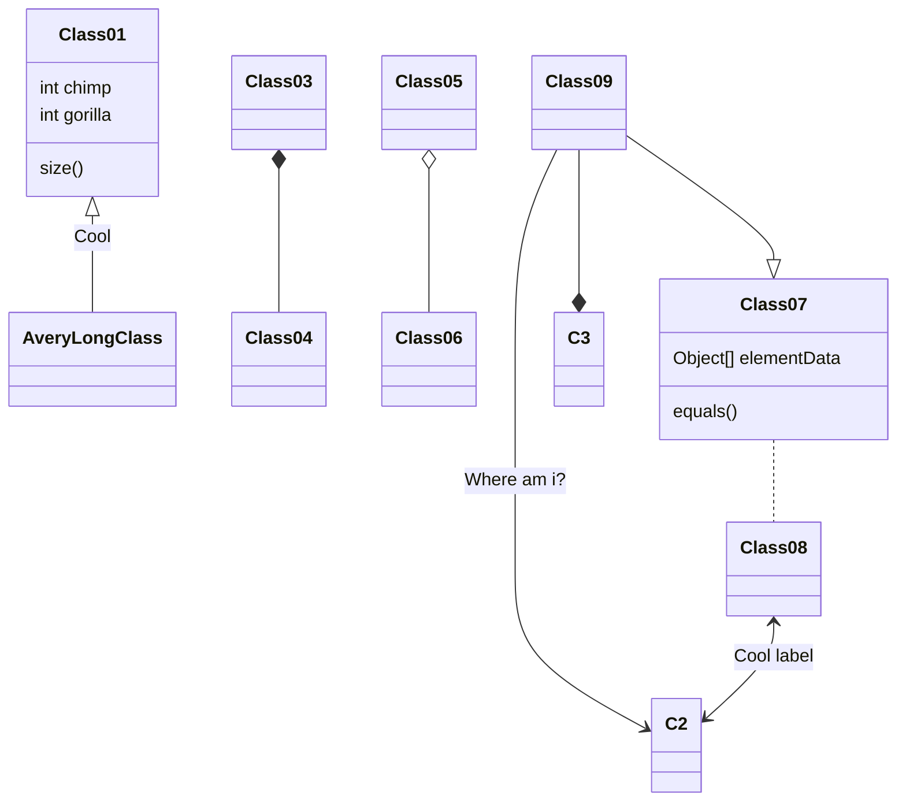
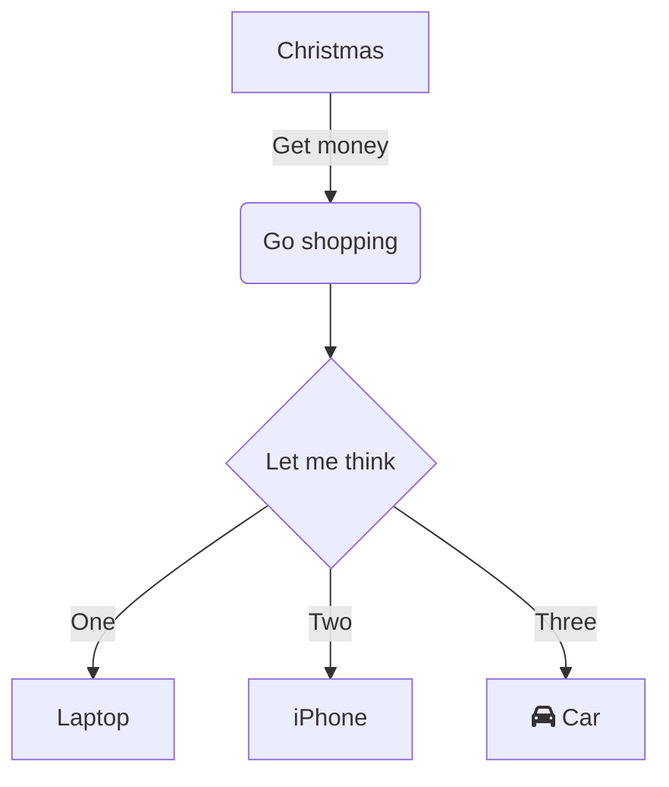
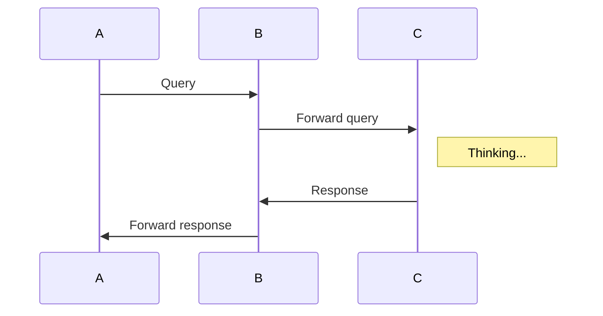

markdown 流程图与 UML 图测试  
<font size=5 color="red"><u>mermaid charts</u></font>  
语法：https://mermaidjs.github.io/（**`需要放在3个反引号的代码块之间，编程语言名称用mermaid`**）

## 1.Flowchart

<div class="cnblogs_Highlighter">
<pre class="brush:sql;gutter:true;">

</pre>
</div>

<center>

</center>

## 2.Sequence diagram

<div class="cnblogs_Highlighter">
<pre class="brush:sql;gutter:true;">

</pre>
</div>

<center>

</center>

## 3.Gantt diagram

<div class="cnblogs_Highlighter">
<pre class="brush:sql;gutter:true;">
    ```mermaid
    gantt
    dateFormat  YYYY-MM-DD
    title Adding GANTT diagram to mermaid
    
    section A section
    Completed task            :done,    des1, 2014-01-06,2014-01-08
    Active task               :active,  des2, 2014-01-09, 3d
    Future task               :         des3, after des2, 5d
    Future task2               :         des4, after des3, 5d
    
    section Critical tasks
    Completed task in the critical line :crit, done, 2014-01-06,24h
    Implement parser and jison          :crit, done, after des1, 2d
    Create tests for parser             :crit, active, 3d
    Future task in critical line        :crit, 5d
    Create tests for renderer           :2d
    Add to mermaid                      :1d
    
    section Documentation
    Describe gantt syntax               :active, a1, after des1, 3d
    Add gantt diagram to demo page      :after a1  , 20h
    Add another diagram to demo page    :doc1, after a1  , 48h
    
    section Last section
    Describe gantt syntax               :after doc1, 3d
    Add gantt diagram to demo page      : 20h
    Add another diagram to demo page    : 48h
    ```
</pre>
</div>

<center>

</center>

## 4.Class diagram

<div class="cnblogs_Highlighter">
<pre class="brush:sql;gutter:true;">

</pre>
</div>

<center>

</center>

### 流程图

<div class="cnblogs_Highlighter">
<pre class="brush:sql;gutter:true;">

</pre>
</div>

<center>

</center>

### 时序图

<div class="cnblogs_Highlighter">
<pre class="brush:sql;gutter:true;">

</pre>
</div>

<center>

</center>

### 甘特

<div class="cnblogs_Highlighter">
<pre class="brush:sql;gutter:true;">
    ```mermaid
    gantt
    dateFormat  YYYY-MM-DD
    title Shop项目交付计划
    
    section 里程碑 0.1 
    数据库设计          :active,    p1, 2016-08-15, 3d
    详细设计            :           p2, after p1, 2d
    
    section 里程碑 0.2
    后端开发            :           p3, 2016-08-22, 20d
    前端开发            :           p4, 2016-08-22, 15d
    
    section 里程碑 0.3
    功能测试            :       p6, after p3, 5d
    上线               :       p7, after p6, 2d
    交付               :       p8, afterp7, 2d
    ```
</pre>
</div>

<center>

</center>

## 扩展阅读

<center>

</center>

[详见"博客园官方博客"之"markdown 流程图与 UML 图测试"](https://www.cnblogs.com/cmt/articles/9255198.html)