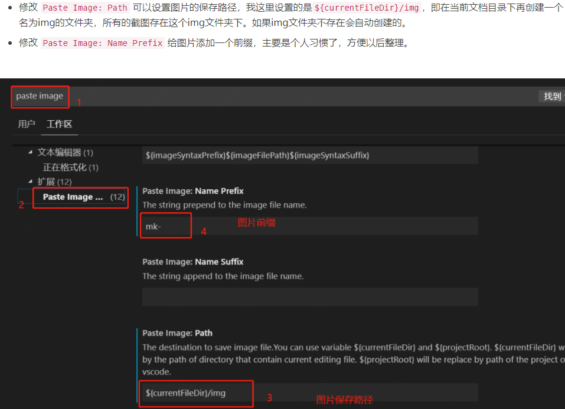

## 用Paste Image插件来方便的给Markdown添加截图的功能

日常用vscode写markdown时可能会需要添加截图，这时一般的做法有两种，

* 一种是把图片上传到图床，然后把图片链接写到\!\[\]\(\)里  
* 另一种是，把图片保存到本地某个目录下，使用相对路径添加图片
这两种方式操作起来都比较麻烦，因为都需要先把截图保存下来，所以有没有类似qq，wechat那种可以直接使用截图的方式呢，最后发现了Paste Image这个插件。

[Paste Image - Visual Studio Marketplace](https://marketplace.visualstudio.com/items?itemName=mushan.vscode-paste-image)

## vscode-hexo插件

充分利用起vscode的插件，让其更便利、更强大！
"paste image" markdown hexo